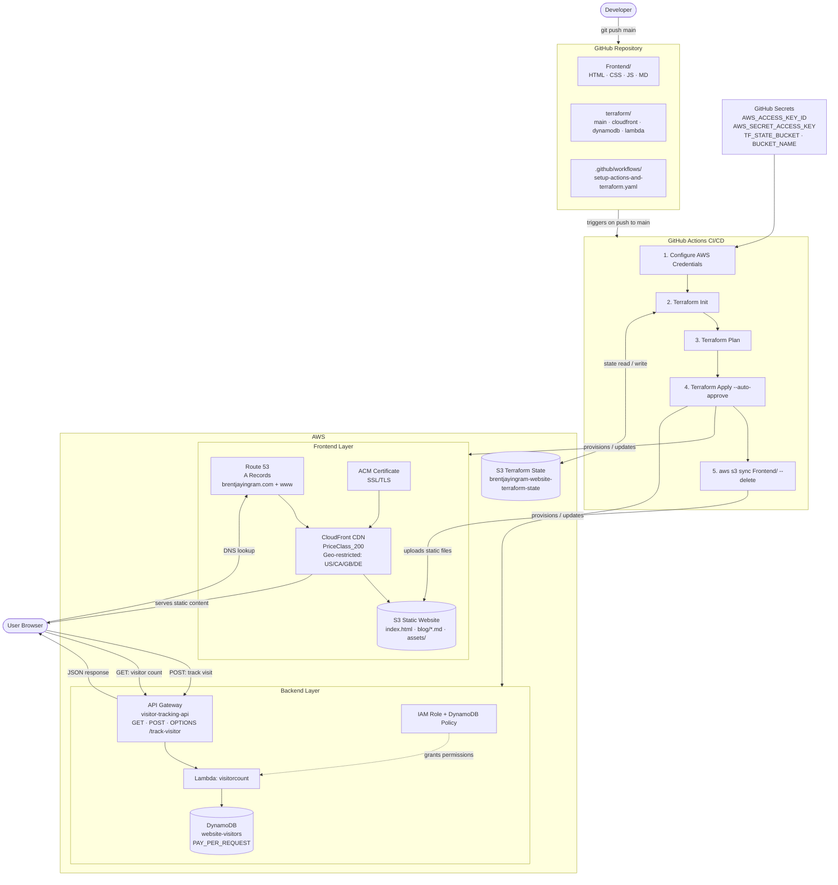

# Cloud Resume Challenge Architecture Diagram

## Mermaid Diagram



---

## ASCII Diagram

```
┌─────────────────────────────────────────────────────────────────────────────────────┐
│                                 GITHUB REPOSITORY                                   │
│  ┌─────────────────┐  ┌─────────────────┐  ┌─────────────────┐  ┌─────────────────┐ │
│  │   Frontend/     │  │   terraform/    │  │  .github/       │  │   Blog Posts    │ │
│  │                 │  │                 │  │  workflows/     │  │                 │ │
│  │ • index.html    │  │ • main.tf       │  │                 │  │ • *.md files    │ │
│  │ • style.css     │  │ • cloudfront.tf │  │ • setup-actions │  │ • content       │ │
│  │ • main.js       │  │ • dynamodb.tf   │  │   -and-         │  │ • metadata      │ │
│  │ • assets/       │  │ • lambda.tf     │  │   terraform.yml │  │                 │ │
│  │ • blog/         │  │ • outputs.tf    │  │                 │  │                 │ │
│  └─────────────────┘  └─────────────────┘  └─────────────────┘  └─────────────────┘ │
└─────────────────────────────────────────────────────────────────────────────────────┘
                                        │
                                        │ git push origin main
                                        ▼
┌─────────────────────────────────────────────────────────────────────────────────────┐
│                              GITHUB ACTIONS CI/CD                                  │
│                                                                                     │
│  1. Configure AWS Credentials                                                       │
│  2. Setup Terraform                                                                 │
│  3. terraform init -backend-config="bucket=terraform-state"                        │
│  4. terraform apply -auto-approve                                                   │
│  5. aws s3 sync Frontend/ s3://bucket --delete                                     │
│  6. aws cloudfront create-invalidation --paths "/*"                                │
└─────────────────────────────────────────────────────────────────────────────────────┘
                                        │
                                        │ deploys to
                                        ▼
┌─────────────────────────────────────────────────────────────────────────────────────┐
│                                 AWS INFRASTRUCTURE                                  │
│                                                                                     │
│  ┌─────────────────────────────────────────────────────────────────────────────┐   │
│  │                            FRONTEND LAYER                                   │   │
│  │                                                                             │   │
│  │  ┌─────────────────┐    ┌─────────────────┐    ┌─────────────────┐        │   │
│  │  │   ROUTE 53      │    │   CLOUDFRONT    │    │   ACM CERT      │        │   │
│  │  │                 │    │                 │    │                 │        │   │
│  │  │ DNS Management  │───▶│ Global CDN      │◀───│ SSL/TLS         │        │   │
│  │  │ • A Records     │    │ • Edge Caching  │    │ • HTTPS         │        │   │
│  │  │ • Domain        │    │ • Performance   │    │ • Security      │        │   │
│  │  │   Routing       │    │ • Distribution  │    │                 │        │   │
│  │  └─────────────────┘    └─────────────────┘    └─────────────────┘        │   │
│  │                                   │                                        │   │
│  │                                   │ serves content from                    │   │
│  │                                   ▼                                        │   │
│  │  ┌─────────────────────────────────────────────────────────────────────┐  │   │
│  │  │                        S3 STATIC WEBSITE                            │  │   │
│  │  │                                                                     │  │   │
│  │  │ • index.html (resume content)                                       │  │   │
│  │  │ • assets/main.js (blog posts array + visitor counter)              │  │   │
│  │  │ • assets/style.css (styling)                                        │  │   │
│  │  │ • blog/*.md (markdown blog posts)                                   │  │   │
│  │  │ • Static website hosting enabled                                    │  │   │
│  │  │ • Public read access                                                │  │   │
│  │  └─────────────────────────────────────────────────────────────────────┘  │   │
│  └─────────────────────────────────────────────────────────────────────────┘   │
│                                                                                 │
│  ┌─────────────────────────────────────────────────────────────────────────┐   │
│  │                            BACKEND LAYER                                │   │
│  │                                                                         │   │
│  │  ┌─────────────────┐    ┌─────────────────┐    ┌─────────────────┐    │   │
│  │  │  API GATEWAY    │    │     LAMBDA      │    │    DYNAMODB     │    │   │
│  │  │                 │    │                 │    │                 │    │   │
│  │  │ REST API        │───▶│ Python Function │───▶│ Visitor Storage │    │   │
│  │  │ • /track-visitor│    │                 │    │                 │    │   │
│  │  │ • GET (count)   │    │ • GET: scan()   │    │ • visitor_id    │    │   │
│  │  │ • POST (track)  │    │ • POST: put()   │    │ • timestamp     │    │   │
│  │  │ • CORS enabled  │    │ • Error handling│    │ • ip_address    │    │   │
│  │  │                 │    │ • JSON response │    │ • user_agent    │    │   │
│  │  └─────────────────┘    └─────────────────┘    └─────────────────┘    │   │
│  │           │                       │                       │            │   │
│  │           │                       │                       │            │   │
│  │  ┌─────────────────────────────────────────────────────────────────┐  │   │
│  │  │                        IAM PERMISSIONS                          │  │   │
│  │  │                                                                 │  │   │
│  │  │ • Lambda execution role                                         │  │   │
│  │  │ • DynamoDB scan/put permissions                                 │  │   │
│  │  │ • API Gateway invoke permissions                                │  │   │
│  │  │ • CloudWatch logs permissions                                   │  │   │
│  │  └─────────────────────────────────────────────────────────────────┘  │   │
│  └─────────────────────────────────────────────────────────────────────┘   │
│                                                                             │
│  ┌─────────────────────────────────────────────────────────────────────┐   │
│  │                       INFRASTRUCTURE LAYER                          │   │
│  │                                                                     │   │
│  │  ┌─────────────────┐    ┌─────────────────┐    ┌─────────────────┐ │   │
│  │  │   TERRAFORM     │    │   S3 BACKEND    │    │   GITHUB        │ │   │
│  │  │                 │    │                 │    │   SECRETS       │ │   │
│  │  │ Infrastructure  │───▶│ State Storage   │◀───│                 │ │   │
│  │  │ as Code         │    │                 │    │ • AWS_ACCESS_   │ │   │
│  │  │ • Declarative   │    │ • Remote state  │    │   KEY_ID        │ │   │
│  │  │ • Version ctrl  │    │ • State locking │    │ • AWS_SECRET_   │ │   │
│  │  │ • Reproducible  │    │ • Collaboration │    │   ACCESS_KEY    │ │   │
│  │  └─────────────────┘    └─────────────────┘    └─────────────────┘ │   │
│  └─────────────────────────────────────────────────────────────────────┘   │
└─────────────────────────────────────────────────────────────────────────────┘
                                        │
                                        │
                                        ▼
┌─────────────────────────────────────────────────────────────────────────────────────┐
│                                USER EXPERIENCE                                      │
│                                                                                     │
│  1. User visits brentjayingram.com                                                 │
│  2. Route 53 resolves DNS to CloudFront                                            │
│  3. CloudFront serves cached content from S3                                       │
│  4. Browser loads HTML/CSS/JS                                                      │
│  5. JavaScript makes POST to API Gateway (track visit)                             │
│  6. JavaScript makes GET to API Gateway (get visitor count)                        │
│  7. Lambda processes requests and updates/queries DynamoDB                         │
│  8. Visitor count displays on website                                              │
│  9. User can navigate blog posts (served from S3)                                  │
└─────────────────────────────────────────────────────────────────────────────────────┘

DATA FLOW:
┌─────────┐    ┌─────────┐    ┌─────────┐    ┌─────────┐    ┌─────────┐
│  User   │───▶│Route 53 │───▶│CloudFrnt│───▶│   S3    │───▶│Browser  │
└─────────┘    └─────────┘    └─────────┘    └─────────┘    └─────────┘
                                                                  │
                                                                  │ API calls
                                                                  ▼
┌─────────┐    ┌─────────┐    ┌─────────┐    ┌─────────┐    ┌─────────┐
│DynamoDB │◀───│ Lambda  │◀───│API Gate │◀───│JavaScript│◀───│Browser  │
└─────────┘    └─────────┘    └─────────┘    └─────────┘    └─────────┘

DEPLOYMENT FLOW:
┌─────────┐    ┌─────────┐    ┌─────────┐    ┌─────────┐    ┌─────────┐
│Developer│───▶│ GitHub  │───▶│Actions  │───▶│Terraform│───▶│  AWS    │
└─────────┘    └─────────┘    └─────────┘    └─────────┘    └─────────┘
   git push       triggers      deploys       manages        resources
```

## Key Integration Points:

### 1. **Code to Infrastructure**
- Terraform files define AWS resources
- GitHub Actions applies Terraform changes
- Infrastructure is version-controlled

### 2. **Content Deployment**
- Frontend files sync to S3 via GitHub Actions
- CloudFront cache invalidation ensures fresh content
- Blog posts are static files served from S3

### 3. **Dynamic Functionality**
- JavaScript in browser calls API Gateway
- API Gateway triggers Lambda function
- Lambda reads/writes to DynamoDB
- Results returned to browser for display

### 4. **Security & Performance**
- Route 53 + CloudFront + ACM provide secure, fast delivery
- IAM roles ensure least-privilege access
- CORS enables secure cross-origin requests

### 5. **Automation**
- Single git push triggers entire deployment
- Infrastructure and content deploy together
- No manual steps required

This architecture demonstrates modern cloud engineering practices: Infrastructure as Code, serverless computing, CI/CD automation, and secure, scalable web applications.