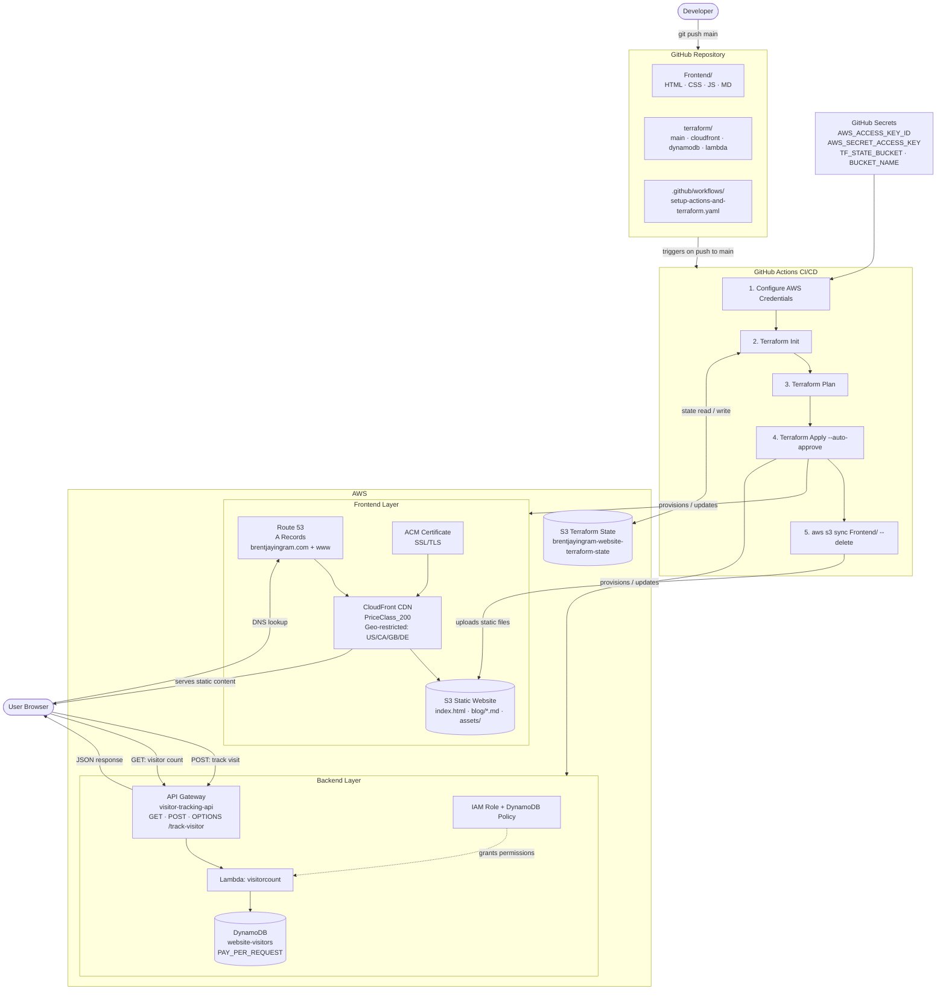

The Cloud Resume Challenge has become a rite of passage for aspiring cloud engineers. What started as a simple static website project evolved into a comprehensive demonstration of modern cloud architecture, infrastructure as code, and DevOps practices. Here's the complete story of how I built my cloud resume using AWS services and Terraform.

---

## The Challenge Overview

The Cloud Resume Challenge, created by Forrest Brazeal, is designed to bridge the gap between cloud certifications and real-world experience. The requirements seem simple on the surface:

- Build a resume website using HTML/CSS/JavaScript
- Deploy it on a cloud provider (I chose AWS)
- Add a visitor counter using a database
- Implement infrastructure as code
- Set up CI/CD for automatic deployments

But as with most cloud projects, the devil is in the details.

---

## Architecture Overview

My final architecture includes:

- **Frontend**: Static HTML/CSS/JavaScript hosted on S3
- **CDN**: CloudFront distribution for global performance
- **DNS**: Route 53 for custom domain management
- **SSL**: ACM certificate for HTTPS
- **Backend**: Lambda function for visitor tracking
- **Database**: DynamoDB for visitor count storage
- **API**: API Gateway for Lambda integration
- **Infrastructure**: Terraform for everything
- **CI/CD**: GitHub Actions for automated deployments

### Architecture Diagram



---

## Step 1: The Static Website Foundation

I started with a clean, professional resume website built with vanilla HTML, CSS, and JavaScript. The key was keeping it simple but modern:

```html
<!DOCTYPE html>
<html lang="en">
<head>
    <meta charset="UTF-8">
    <meta name="viewport" content="width=device-width, initial-scale=1.0">
    <title>Brent Ingram - Cloud Engineer</title>
    <link rel="stylesheet" href="assets/style.css">
</head>
<body>
    <!-- Resume content -->
    <div id="visitor-count"></div>
    <script src="assets/main.js"></script>
</body>
</html>
```

The website includes:
- Professional summary and experience
- Skills and certifications
- Blog section with technical posts
- Contact information
- Visitor counter (the fun part!)

---

## Step 2: S3 Static Website Hosting

AWS S3 provides an excellent platform for static website hosting. I configured:

```hcl
resource "aws_s3_bucket" "website" {
  bucket = var.bucket_name
}

resource "aws_s3_bucket_website_configuration" "website" {
  bucket = aws_s3_bucket.website.id

  index_document {
    suffix = "index.html"
  }
}

resource "aws_s3_bucket_policy" "website" {
  bucket = aws_s3_bucket.website.id

  policy = jsonencode({
    Version = "2012-10-17"
    Statement = [
      {
        Effect    = "Allow"
        Principal = "*"
        Action    = "s3:GetObject"
        Resource  = "${aws_s3_bucket.website.arn}/*"
      }
    ]
  })
}
```

This creates a publicly accessible S3 bucket configured for static website hosting.

---

## Step 3: CloudFront Distribution

To improve performance and enable HTTPS, I added CloudFront:

```hcl
resource "aws_cloudfront_distribution" "website" {
  origin {
    domain_name = aws_s3_bucket_website_configuration.website.website_endpoint
    origin_id   = "S3-${var.bucket_name}"
    
    custom_origin_config {
      http_port              = 80
      https_port             = 443
      origin_protocol_policy = "http-only"
      origin_ssl_protocols   = ["TLSv1.2"]
    }
  }

  enabled             = true
  is_ipv6_enabled     = true
  default_root_object = "index.html"

  aliases = ["brentjayingram.com", "www.brentjayingram.com"]

  default_cache_behavior {
    allowed_methods        = ["DELETE", "GET", "HEAD", "OPTIONS", "PATCH", "POST", "PUT"]
    cached_methods         = ["GET", "HEAD"]
    target_origin_id       = "S3-${var.bucket_name}"
    viewer_protocol_policy = "redirect-to-https"
    
    forwarded_values {
      query_string = false
      cookies {
        forward = "none"
      }
    }
  }

  viewer_certificate {
    acm_certificate_arn = data.aws_acm_certificate.my_domain.arn
    ssl_support_method  = "sni-only"
  }
}
```

CloudFront provides:
- Global edge locations for faster loading
- HTTPS termination
- Caching for improved performance
- Custom domain support

---

## Step 4: Custom Domain with Route 53

I registered my domain and configured DNS:

```hcl
resource "aws_route53_zone" "my_domain" {
  name = "brentjayingram.com"
}

resource "aws_route53_record" "cloudfront" {
  for_each = toset(aws_cloudfront_distribution.website.aliases)
  zone_id  = aws_route53_zone.my_domain.zone_id
  name     = each.value
  type     = "A"

  alias {
    name                   = aws_cloudfront_distribution.website.domain_name
    zone_id                = aws_cloudfront_distribution.website.hosted_zone_id
    evaluate_target_health = false
  }
}
```

This creates A records that point both the root domain and www subdomain to the CloudFront distribution.

---

## Step 5: The Visitor Counter Backend

The visitor counter required several AWS services working together:

### DynamoDB Table
```hcl
resource "aws_dynamodb_table" "visitor_tracking" {
  name         = "website-visitors"
  billing_mode = "PAY_PER_REQUEST"
  hash_key     = "visitor_id"

  attribute {
    name = "visitor_id"
    type = "S"
  }

  tags = {
    Environment = "production"
    Purpose     = "visitor-tracking"
  }
}
```

### Lambda Function
```python
import json, boto3, uuid
from datetime import datetime

dynamodb = boto3.resource('dynamodb')
table = dynamodb.Table('website-visitors')

def lambda_handler(event, context):
    headers = {
        'Access-Control-Allow-Origin': '*',
        'Access-Control-Allow-Methods': 'GET,POST,OPTIONS',
        'Access-Control-Allow-Headers': 'Content-Type,Authorization,X-Amz-Date,X-Api-Key,X-Amz-Security-Token',
        'Content-Type': 'application/json'
    }

    try:
        method = event.get('httpMethod', 'GET')

        if method == 'OPTIONS':
            return {'statusCode': 200, 'headers': headers, 'body': ''}

        if method == 'GET':
            resp = table.scan(Select='COUNT')
            return {'statusCode': 200, 'headers': headers, 'body': json.dumps({'count': resp['Count']})}

        # POST - track new visitor
        visitor_id = str(uuid.uuid4())
        item = {
            'visitor_id': visitor_id,
            'timestamp': datetime.utcnow().isoformat(),
            'ip_address': event.get('requestContext', {}).get('identity', {}).get('sourceIp'),
            'user_agent': (event.get('headers') or {}).get('User-Agent')
        }
        table.put_item(Item=item)
        return {'statusCode': 200, 'headers': headers, 'body': json.dumps({'visitor_id': visitor_id})}

    except Exception as e:
        return {
            'statusCode': 500,
            'headers': headers,
            'body': json.dumps({'error': str(e)})
        }
```

### API Gateway
```hcl
resource "aws_api_gateway_rest_api" "visitor_api" {
  name        = "visitor-tracking-api"
  description = "API for visitor tracking"
}

resource "aws_api_gateway_resource" "visitor_resource" {
  rest_api_id = aws_api_gateway_rest_api.visitor_api.id
  parent_id   = aws_api_gateway_rest_api.visitor_api.root_resource_id
  path_part   = "track-visitor"
}
```

---

## Step 6: Frontend Integration

The JavaScript code handles both tracking visits and displaying the count:

```javascript
// Track visitor on page load
fetch('https://API_GATEWAY_ID.execute-api.us-east-1.amazonaws.com/dev/track-visitor', {
    method: 'POST'
}).catch(() => {}); // Silent fail

// Fetch and display visitor count
fetch('https://API_GATEWAY_ID.execute-api.us-east-1.amazonaws.com/dev/track-visitor')
  .then(res => res.json())
  .then(data => {
    document.getElementById('visitor-count').textContent = `• ${data.count} visitors`;
  })
  .catch(() => {});
```

---

## Step 7: Infrastructure as Code with Terraform

Everything is managed through Terraform, organized into logical modules:

- `main.tf` - S3 bucket and basic configuration
- `cloudfront.tf` - CDN and SSL certificate
- `dynamodb.tf` - Database for visitor tracking
- `lambda.tf` - Serverless backend and API Gateway
- `outputs.tf` - Important values for reference

This approach provides:
- Version control for infrastructure
- Reproducible deployments
- Easy environment management
- Documentation through code

---

## Step 8: CI/CD with GitHub Actions

Automated deployment pipeline:

```yaml
name: Deploy Website
on:
  push:
    branches: [main]

jobs:
  deploy:
    runs-on: ubuntu-latest
    steps:
      - uses: actions/checkout@v4
      
      - name: Configure AWS credentials
        uses: aws-actions/configure-aws-credentials@v4
        with:
          aws-access-key-id: ${{ secrets.AWS_ACCESS_KEY_ID }}
          aws-secret-access-key: ${{ secrets.AWS_SECRET_ACCESS_KEY }}
          aws-region: us-east-1
          
      - name: Setup Terraform
        uses: hashicorp/setup-terraform@v3
        
      - name: Terraform Apply
        run: |
          terraform init -backend-config="bucket=${{ secrets.TF_STATE_BUCKET }}"
          terraform apply -auto-approve -var="bucket_name=${{ secrets.BUCKET_NAME }}"
        working-directory: terraform
        
      - name: Sync website files
        run: aws s3 sync Frontend/ s3://${{ secrets.BUCKET_NAME }} --delete
        
      - name: Invalidate CloudFront Cache
        run: |
          DISTRIBUTION_ID=$(aws cloudfront list-distributions --query "DistributionList.Items[?Aliases.Items[0]=='brentjayingram.com'].Id" --output text)
          aws cloudfront create-invalidation --distribution-id $DISTRIBUTION_ID --paths "/*"
```

This pipeline:
- Triggers on every push to main
- Applies Terraform changes
- Syncs website files to S3
- Invalidates CloudFront cache for immediate updates

---

## Challenges and Lessons Learned

### 1. IAM Permissions
Getting Lambda permissions right for DynamoDB access was tricky. The key was creating a specific policy:

```hcl
resource "aws_iam_role_policy" "visitor_lambda_dynamodb_policy" {
  name = "visitor-lambda-dynamodb-policy"
  role = "visitorcount-role-kznqyqzv"

  policy = jsonencode({
    Version = "2012-10-17"
    Statement = [
      {
        Effect = "Allow"
        Action = [
          "dynamodb:Scan",
          "dynamodb:PutItem",
          "dynamodb:UpdateItem",
          "dynamodb:GetItem"
        ]
        Resource = aws_dynamodb_table.visitor_tracking.arn
      }
    ]
  })
}
```

### 2. CORS Configuration
API Gateway CORS was essential for the frontend to communicate with the backend. This required proper headers in both the Lambda function and API Gateway configuration.

### 3. CloudFront Caching
Updates weren't appearing immediately due to CloudFront caching. Adding cache invalidation to the CI/CD pipeline solved this.

### 4. State Management
Using S3 backend for Terraform state with proper locking via DynamoDB prevented state corruption during concurrent deployments.

---

## Cost Optimization

The entire infrastructure runs for approximately $2-3 per month:

- **S3**: ~$0.50 (storage and requests)
- **CloudFront**: ~$0.50 (data transfer)
- **Route 53**: $0.50 (hosted zone)
- **Lambda**: Nearly free (within free tier)
- **DynamoDB**: Nearly free (within free tier)
- **API Gateway**: ~$1.00 (requests)

The pay-per-request model for DynamoDB and Lambda keeps costs minimal for a personal website.

---

## Security Considerations

- **HTTPS Everywhere**: All traffic encrypted via CloudFront
- **Least Privilege IAM**: Lambda has minimal required permissions
- **No Hardcoded Secrets**: All sensitive values in GitHub Secrets
- **Input Validation**: Lambda validates all incoming requests
- **CORS Restrictions**: API only accepts requests from my domain

---

## Monitoring and Observability

- **CloudWatch Logs**: Lambda execution logs
- **CloudWatch Metrics**: API Gateway and Lambda metrics
- **DynamoDB Metrics**: Read/write capacity monitoring
- **CloudFront Metrics**: Cache hit rates and performance

---

## Future Enhancements

Potential improvements I'm considering:

1. **Enhanced Analytics**: Track more visitor data (geolocation, referrers)
2. **Contact Form**: Add a serverless contact form using SES
3. **Blog Comments**: Implement a commenting system
4. **Performance Monitoring**: Add Real User Monitoring (RUM)
5. **Multi-Region**: Deploy to multiple regions for better performance

---

## Final Thoughts

The Cloud Resume Challenge taught me that building in the cloud isn't just about knowing individual services—it's about understanding how they work together. Every component has dependencies, and getting the integration right is where the real learning happens.

The project demonstrates several key cloud engineering principles:

- **Infrastructure as Code**: Everything is reproducible and version-controlled
- **Serverless Architecture**: Pay only for what you use
- **Security by Design**: Least privilege and encryption everywhere
- **Automation**: CI/CD eliminates manual deployment errors
- **Monitoring**: Observability built in from the start

Most importantly, it's a living project. Every blog post I write, every improvement I make, and every visitor who stops by adds to the story. That's the real value of the Cloud Resume Challenge—it's not just a project you complete, it's a platform you build upon.

The complete source code is available on my [GitHub repository](https://github.com/brentjayingram/brentjayingramwebsite), and the live site is running at [brentjayingram.com](https://brentjayingram.com).

---

*Want to tackle the Cloud Resume Challenge yourself? Start with the [official challenge guide](https://cloudresumechallenge.dev/) and remember: the goal isn't perfection on the first try—it's learning through building.*